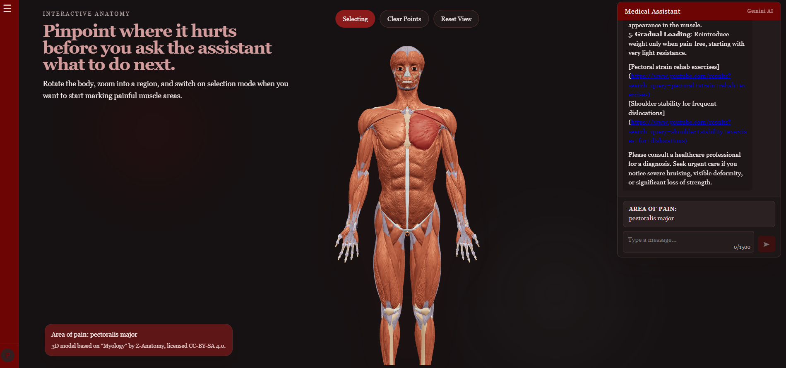

<h1>Doctor AI-kā-sāp</h1>

<h2>IDEJAS APRAKSTS</h2>

<p><strong>Doctor W.</strong> ir virtuāls dakteris, kurš ir piemērots analizēt traumas. Viņš neaizstāj (un neaizstāv) īstus ārstus vai medicīniskās analīzes, bet kalpo kā sākuma punkts, lai saprastu, ko darīt līdz ārsta apmeklējumam.</p>

<p>Ieejot tīmekļa vietnē, lietotājam būs iespēja:</p>
<ul>
  <li>Izveidot vai pievienoties savam kontam</li>
  <li>Ievadīt personīgo informāciju (fizisko aktivitāšu daudzums, vecums, sporta veidi u.tml.)</li>
  <li>Izvēlēties, kur/kas sāp</li>
</ul>

<p>Lietotājs varēs raksturot:</p>
<ul>
  <li>Kas noticis</li>
  <li>Kad tas noticis</li>
  <li>Kur tas noticis</li>
  <li>Kā izpaužas sāpes</li>
</ul>

<p>Ievadot šo informāciju, būs iespējams sarunāties ar MI palīgu, kurš ir trenēts analizēt un atbildēt uz šāda veida jautājumiem. Sarunu varēs turpināt, lai:</p>
<ul>
  <li>Noskaidrotu iespējamos sāpju cēloņus</li>
  <li>Saņemtu ieteikumus, ko darīt traumas gadījumā</li>
</ul>

<hr>

<h2>PROBLĒMAS ANALĪZE</h2>

<p>Cilvēki ir trausli – bieži notiek dažādi negadījumi, kas izraisa fiziskas traumas. Parasti šādos gadījumos būtu jāapmeklē ārsts, lai noskaidrotu, kas noticis un ko darīt tālāk.</p>

<p>Problēma:</p>
<ul>
  <li>Ārsti bieži ir aizņemti</li>
  <li>Vizīte var būt pēc vairākām nedēļām</li>
  <li>Līdz vizītei simptomi var mazināties</li>
</ul>

<p>Rezultātā cilvēki:</p>
<ul>
  <li>Atliek ārsta apmeklējumu</li>
  <li>Dzīvo ar nepilnīgi ārstētām traumām</li>
  <li>Sastopas ar sekām vēlāk dzīvē</li>
</ul>

<hr>

<h2>MĒRĶAUDITORIJA / LIETOTĀJI</h2>

<p>Mērķauditorija:</p>
<ul>
  <li>Cilvēki, kuri nesen ieguvuši fiziskas traumas</li>
  <li>Visas vecuma grupas</li>
</ul>

<hr>

<h2>KĀPĒC</h2>

<p>Veselība ir prioritāte. Taču realitātē:</p>
<ul>
  <li>Vizītes tiek atliktas</li>
  <li>Ir nepieciešams ātrs pagaidu risinājums</li>
</ul>

<p>Šis MI palīgs:</p>
<ul>
  <li>Nav ārsts</li>
  <li>Balstās uz plašu medicīnisko informāciju</li>
  <li>Spēj sniegt strukturētu un loģisku sākotnējo izvērtējumu bez fiziskas pārbaudes</li>
</ul>

<p>Tas kalpo kā informatīvs atbalsts līdz profesionālai konsultācijai.</p>

<hr>

<h2>IZMANTOTĀS TEHNOLOĢIJAS</h2>

<h3>FRONTEND</h3>
<ul>
  <li>JavaScript</li>
  <li>React</li>
  <li>HTML5 + CSS3</li>
  <li>Three.js / React Three Fiber</li>
</ul>

<h3>BACKEND</h3>
<ul>
  <li>Node.js</li>
  <li>Express.js</li>
  <li>REST API</li>
</ul>

<h3>DATUBĀZE</h3>
<ul>
  <li>MongoDB</li>
</ul>

<h3>MĀKSLĪGAIS INTELEKTS</h3>
<ul>
  <li>OpenAI API (ChatGPT)</li>
</ul>

<h3>PAPILDU RĪKI</h3>
<ul>
  <li>Git + GitHub</li>
  <li>Vite</li>
  <li>VS Code</li>
</ul>

<hr>

<h2>PIEGĀDES FORMĀTS</h2>

<p>Tīmekļa vietne.</p>

<p>Šis formāts izvēlēts, jo tas ir vispieejamākais piegādes veids, kas ļauj platformai būt pieejamai jebkurā ierīcē bez papildu lejupielādēm.</p>

<hr>

<h2>PLĀNS 10 NEDĒĻĀM</h2>

<table>
  <tr>
    <th>Nedēļa</th>
    <th>Vēlamais rezultāts</th>
  </tr>
  <tr>
    <td>1</td>
    <td>Izveidot pamata tīmekļa vietni ar pogām un izkārtojumu</td>
  </tr>
  <tr>
    <td>2–3</td>
    <td>Ieviest kontu sistēmu un datu saglabāšanu</td>
  </tr>
  <tr>
    <td>4–5</td>
    <td>Integrēt 3D cilvēka modeli</td>
  </tr>
  <tr>
    <td>6–7</td>
    <td>Ieviest klikšķināmas ķermeņa zonas</td>
  </tr>
  <tr>
    <td>8</td>
    <td>Savienot ar ChatGPT API</td>
  </tr>
  <tr>
    <td>9</td>
    <td>Attēlot MI atbildes un saglabāt čata vēsturi</td>
  </tr>
  <tr>
    <td>10</td>
    <td>Pilna testēšana un labojumi</td>
  </tr>
</table>

## Local development

```sh
npm install
npm run dev
```

## Deployment target

This project is configured for Vercel with `@sveltejs/adapter-vercel`.

## Environment variables

Set these in Vercel before deploying:

```sh
SUPABASE_URL=...
SUPABASE_ANON_KEY=...
GEMINI_API_KEY=...
PUBLIC_MODEL_URL=
PUBLIC_MYOLOGY_MODEL_ROOT=/myology
```

`PUBLIC_MODEL_URL` is optional and takes priority when set. Use it when your `.gltf` file is hosted directly on Cloudflare or another CDN.

`PUBLIC_MYOLOGY_MODEL_ROOT` is also optional. Leave it as `/myology` if you host the 3D model files inside the app. Set it to an external folder URL if you host the anatomy model on a CDN, Supabase Storage, Vercel Blob, or another static host.

## Deploy to a real URL

### Option 1. Vercel dashboard

1. Push this repo to GitHub, GitLab, or Bitbucket
2. Import the repo into Vercel
3. Add the environment variables above
4. If the `.gltf` file is hosted on Cloudflare, set `PUBLIC_MODEL_URL` to the full public URL of that `scene.gltf` file
5. Otherwise, if you are not storing the anatomy model inside the repo, set `PUBLIC_MYOLOGY_MODEL_ROOT` to the public folder URL that contains `scene.gltf`, `scene.bin`, and `license.txt`
6. Deploy

### Option 2. Vercel CLI

```sh
npx vercel
```

## Anatomy model on Vercel

`static/myology/scene.bin` is about 161 MB, which is too large for a normal GitHub push. For a quick Vercel connection, use one of these:

1. Host `scene.gltf` and its referenced files somewhere public and set `PUBLIC_MODEL_URL` to the full public URL of `scene.gltf`.
2. Host the `myology` folder somewhere public and set `PUBLIC_MYOLOGY_MODEL_ROOT` to that folder URL.
3. Use Git LFS for `static/myology/scene.bin` before pushing to GitHub.

If you use the folder-based option, the folder must contain:

```txt
scene.gltf
scene.bin
license.txt
```

## Supabase setup after deploy

Once Vercel gives you the real URL, add it in Supabase Auth settings:

- Site URL: `https://your-domain.vercel.app`
- Redirect URL: `https://your-domain.vercel.app/reset-password`

If you attach a custom domain later, add that too.

## Notes

- Auth cookies are marked `secure` in production.
- Password reset already uses the request origin, so deployed reset links will use the real site URL.
- The Three.js anatomy viewer is client-rendered, while auth and chat stay server-backed.
